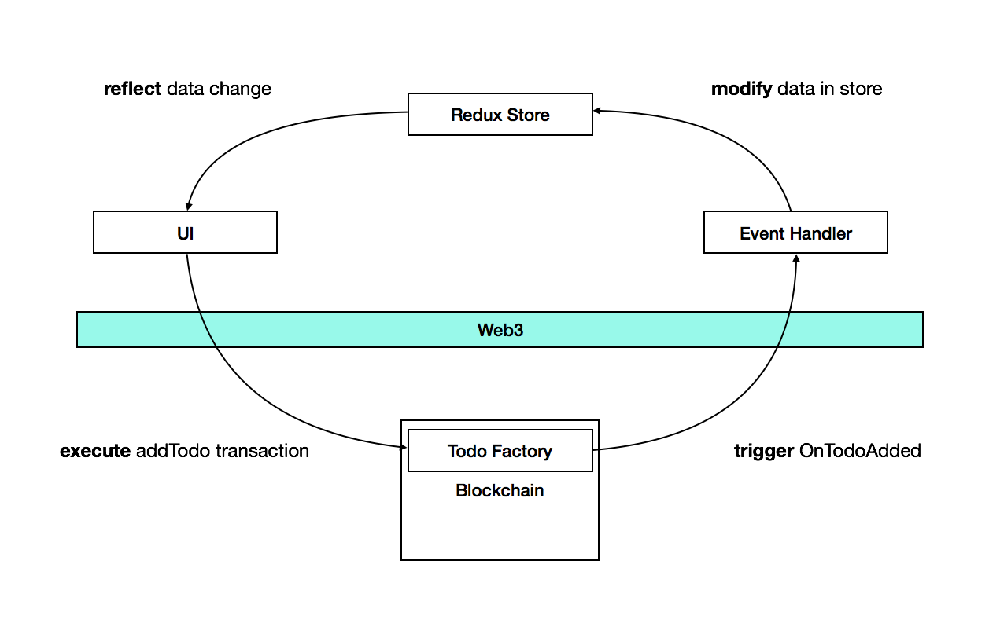

## Web3.js
[Web3.js](https://github.com/ethereum/web3.js/) 提供 javascript 用來和以太坊互動的 API，這邊使用的版本是 v1.0，v1.0 與之前的版本有相當大的差別，除了額外提供 Socket 接口監聽事件，API 的呼叫方式也完全不同，甚至有些連運作的邏輯也不同，所以在查詢資料上需要特別注意這點。前端的功能除了傳統 Todo App 的新增、刪除、標記完成任務的功能之外，還可以列出這個 DAPP 過去的操作紀錄。但這邊只會強調與 web3 相關的接口部分，其餘的部分請看完整的[程式碼](https://github.com/pomelyu/EthereumTodo.git)，運作流程如下：



### Step1. 安裝 web3
```bash
npm install web3
```

### Step2. 初始化 web3
```javascript
// ethereum-todo/src/config/config-web3.js

// 使用 websocket
// localhost:8545 是利用 truffle 建立的測試用區塊鏈
// const web3 = new Web3(new Web3.providers.WebsocketProvider('ws://localhost:8545')) 
const web3 = new Web3('ws://localhost:8545');

// or 使用 http
// const web3 = new Web3(new Web3.providers.HttpProvider('ws://localhost:8545')) 
// const web3 = new Web3('http://localhost:8545');
```
除了自己架設測試的區塊鏈外，也可以使用[公開的測試區塊鏈](https://medium.com/taipei-ethereum-meetup/ethereum-智能合約開發筆記-不用自己跑節點-使用-infura-和-web3-js-呼叫合約-2b8c852ed3d2)。

### Step3. 初始化合約
這邊需要用到合約的 ABI（Application Binary Interface） 以及在區塊鏈上佈署的位址，ABI 就是紀錄合約中使用到的函數和變數的文件，[這裡](https://medium.com/taipei-ethereum-meetup/ethereum-智能合約開發筆記-深入智能合約-abi-268ececb70ae)有更詳細的說明，首先先將前一個部分編譯後的檔案（`build/contracts/TodoFactory.json`）複製到專案資料夾
```javascript
// ethereum-todo/src/contracts/todoContract
import web3 from 'config/config-web3';
import TodoFactoryJSON from './TodoFactory.json';

const CONTRACT_ADDRESS = '0x21e4624c5a0b3fda81d0833d412dded2bb3a7a7c';
const todoContract = new web3.eth.Contract(TodoFactoryJSON.abi, CONTRACT_ADDRESS);

export default todoContract;
```
這樣就建立一個合約的實體可供操作

### Step4. 執行合約
重複前面提到的，**Transaction** 合約的執行需要消耗 **gas**，所以我們需要有一個帳號來花費 **gas** 執行這些合約，可以從 truffle 建立的區塊鏈中找到測試用的帳號（也就是執行時建立的那十個），並藉著 web3 提供的 api 查看帳號擁有的 **gas**：
```javascript
// ethereum-todo/src/helpers/accountsHelper/balance.js
import web3 from 'config/config-web3';

export async function getBalanceAsync(address) {
  const balance = await web3.eth.getBalance(address);
  return balance;
}

// 接者可以在任何地方使用 getBalanceAsync 來取得特定使用者目前的 gas 量，例如
// const DEFAULT_USER = '0x1d489c3f8ed5ee71325a847888b2157c9ac29c05';
//
// void async function() {
//   const balance = await getBalanceAsync(DEFAULT_USER);
//   console.log('Balance of account0', balance);
// }()
```

在 web3 中 **Call** 和 **Transaction** 分別對應 `contract.methods.myMethod.call` 和 `contract.methods.myMethod.send` 兩種呼叫方式，後者在之前的版本是 `sendTransaction`。兩者的使用如下
```javascript
// ethereum-todo/src/helpers/todoHelpers/todoAction.js
import todoContract from 'contracts/todoContract';

// 第一個測試帳號的 gas 數目相當多，很適合用來測試合約的執行
const DEFAULT_USER = '0x1d489c3f8ed5ee71325a847888b2157c9ac29c05';

export async function getTodoAsync(todoId) {
  // 估計需要消耗的 gas
  const gas = await todoContract.methods.getTodo(todoId).estimateGas();
  console.log('Get Todo: Estimated gas', gas);
  // 因為 getTodo 不會修改到資料，所以用 call 
  const result = await todoContract.methods.getTodo(todoId).call({
    from: DEFAULT_USER,
    gas:200000,
  });
  return result;
}

export async function addTodoAsync(taskName) {
  // 估計需要消耗的 gas，因為必須寫入字串，所以很可能會消耗超過預設值 90000 的 gas，
  // 故調高 gas limit 到 200000
  const gas = await todoContract.methods.addTodo(taskName).estimateGas();
  console.log('AddTodo: Estimated gas', gas);
  // 因為 addTodo 會修改資料，所以必須用 send
  // 如果這邊改成 call，依然可以執行，但不會有資料的寫入
  await todoContract.methods.addTodo(taskName).send({
    from: DEFAULT_USER,
    gas: 200000,
  });
}
```

無論用 `call` 或是 `send` 都可以指定消耗的 **gas** 最大值（稱為 gas limit 這裡是 200000），gas limit 的設計是為了防止智慧合約在執行時產生無窮迴圈的情形，因為所有的運算都需要消耗 gas，一旦消耗 gas 的總量到達 gas limit，就會終止執行。

### Step5. 監聽執行的結果
還是一樣 `Transaction` 的執行需要等到礦工們寫入資料才算真的完成，因此只能利用監聽事件的方式來確定。在這個專案中將這些監聽的處理放在 `src/events` 資料夾下，未來或許放在 middleware 是比較漂亮的方式。
```javascript
// ethereum-todo/src/events/todoEvents.js
import todoContract from 'contracts/todoContract';
import * as todoHelper from 'helpers/todoHelpers';
import { addTodo, deleteTodo, completeTodo } from 'containers/App/duck/todo';

import store from '../store';

// Event
// OnTodoAdded 是 event 的名稱
todoContract.events.OnTodoAdded({
}, async (error, result) => {
  if (error) {
    console.log(error);
    return;
  }
  // result
  // {
  //   raw: {
  //     data: "0x0000000000000000000000000000000000000000000000000000000000000001",
  //     topics: ["0x6edbfebf4adc3e180444860a21cd838446f00049410a44c6ec4a178a2ebe529b"]
  //   },
  //   returnValues: {
  //     todoId: 1
  //   },
  //   address: "0x21e4624c5A0B3fdA81D0833d412DDED2bb3A7a7C", // 合約的 address
  //   blockHash: "0x9186b52740bff34239c92137ae1ecb7205a028b540e30b79256b13b829354252",
  //   blockNumber: 61,
  //   event: "OnTodoAdded",
  //   signature: "0x6edbfebf4adc3e180444860a21cd838446f00049410a44c6ec4a178a2ebe529b",
  //   transactionHash: "0x997195a40d9ad102b0c18b730711fec0623596643c5820253296415b816563a3",
  //   transactionIndex: 0,
  //   type: "mined"
  // }
  const { returnValues: { todoId } } = result;

  // 因為事件的回傳值只有 todoId，因此還需要取得完整的 todo 資料。
  const todo = await todoHelper.getTodoAsync(todoId);
  store.dispatch(addTodo(todoId, todo[0], todo[1]));
  console.log('Add', todoId);
});
```

### Step6. 獲取過去的事件
區塊鏈可以視為一個保存操作紀錄並且確保這些紀錄無法被竄改的資料庫，因此上述的操作事件都會被紀錄在區塊鏈上，web3 提供 `getPastEvents` 這個 api 來取得過去的事件（web3 在 v1.0 版本前要取得過去的事件需要持續監聽，而非直接傳回結果）
```javascript
// ethereum-todo/src/helpers/todoHelpers/eventLogs.js
import todoContract from 'contracts/todoContract';

export async function getAllEventsAsync() {
  const events = await todoContract.getPastEvents('allEvents', {
    // 也就是取得從第一個區塊到最新區塊的所有事件
    fromBlock: 0,
    toBlock: 'latest'
  });
  // events 是一個陣列，陣列元素與前述監聽事件的回傳值相同
  return events;
}
```

透過以上的兩個部分已經可以利用智慧合約在區塊鏈上寫一個 Todo DApp，不過使用的方式仍然相當侷限，也忽略不少實際上可能會碰到的問題，事實上光是如何適當的儲存資料在區塊鏈上就是一大挑戰，這個專案可以當作簡單基底，繼續深入研究。

## 參考資料
- [在公開測試鏈上部署合約](https://medium.com/taipei-ethereum-meetup/ethereum-智能合約開發筆記-不用自己跑節點-使用-infura-和-web3-js-呼叫合約-2b8c852ed3d2)。
- [深入智能合約 ABI](https://medium.com/taipei-ethereum-meetup/ethereum-智能合約開發筆記-深入智能合約-abi-268ececb70ae)